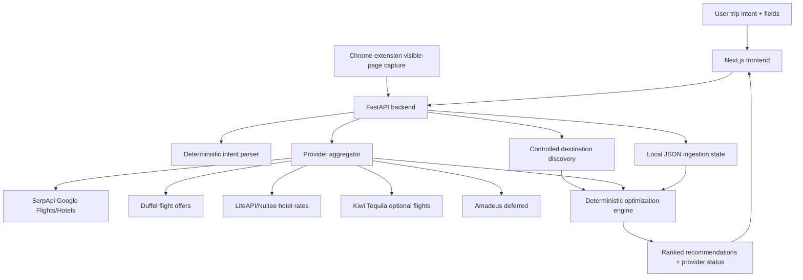
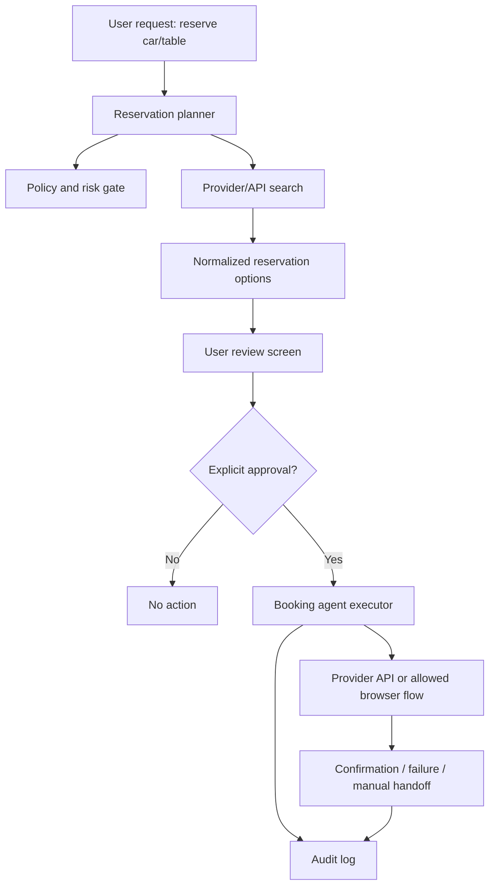

# Travel Booking Optimizer Technical Summary

Last updated: 2026-06-10

## Executive Summary

Travel Booking Optimizer is a prompt-first travel shopping and loyalty optimization product. The product goal is not simply to track points balances. The goal is to help a traveler decide how to book a trip using their actual travel constraints, live market prices, loyalty balances, transfer options, credit card offers, provider reliability, and convenience preferences.

The current prototype lets a user enter a natural-language intent such as:

> Find me a 5 star hotel inside a 2 hour flight from the Bay Area, highly rated, under $500 per night.

The system parses that intent, runs controlled live searches across provider APIs, builds flight + hotel itinerary candidates, scores the options deterministically, and displays expandable recommendation cards with price math, provider status, constraint fit, and verification links.

The key architectural principle is that deterministic systems own money math and ranking inputs. AI/agents should assist with interpretation, explanation, search orchestration, and eventually supervised booking execution, but they should not invent prices, calculate cents-per-point, or make unsupervised financial decisions.

Current production-like live data sources include SerpApi for Google Flights/Hotels, Duffel for flight offers and future booking workflow, and LiteAPI/Nuitee for hotel rates and future hotel booking workflow. The current app is search/recommendation first. It does not autonomously book travel yet.

The next strategic product step is to introduce supervised agents that can book or reserve travel-adjacent items, starting with lower-risk reservations such as rental cars and restaurant tables. The recommended approach is to create a booking-agent framework with explicit approval gates, audit trails, dry-run mode, provider abstractions, and scoped payment capability later via infrastructure such as Crossmint and Lobster Cash.

## Business Case

Travel planning is fragmented across airlines, hotels, OTAs, credit card travel portals, loyalty programs, and card-linked offers. A traveler often has several ways to pay for the same trip:

- Cash through an airline, hotel, OTA, or metasearch handoff.
- Points through airline or hotel award programs.
- Bank points through Amex Membership Rewards, Chase Ultimate Rewards, or card travel portals.
- Transfers from flexible points programs to airline/hotel partners.
- Cash bookings enhanced by statement credits, card offers, elite benefits, or portal multipliers.

The core user pain is not lack of information. The pain is comparison across incompatible currencies, rules, and constraints:

- Is a 65,000-point redemption better than a $610 cash fare?
- Does a $300 hotel credit make a cash hotel better than using points?
- Is the cheapest option too inconvenient because of layovers, late arrivals, or hotel location?
- Is a search result production inventory, sandbox inventory, a fallback estimate, or a Google verification link?
- Which option should the user trust enough to click through and book?

The product opportunity is a decision engine that creates a unified booking recommendation:

1. Understand the trip intent.
2. Search live travel inventory.
3. Normalize cash, points, offers, fees, and convenience.
4. Rank booking paths.
5. Explain why a path wins.
6. Eventually execute low-risk bookings or reservations under user supervision.

The user value is time saved, better redemption value, fewer missed credits/offers, and more confidence in booking decisions.

## Current Product Experience

The current frontend is a minimalist travel-search workspace:

- A large natural-language prompt input sits above standard travel fields.
- Standard fields refine or override the prompt: origin, destination/scope, dates, budget, hotel details, ranking mode, direct-flight preference, travel-time preference, and loyalty programs.
- The output is a list of suggested itineraries, not standalone fare cards.
- Each recommendation card can expand to show:
  - Booking path.
  - Payment math.
  - Provider details.
  - Flight leg.
  - Hotel leg.
  - Constraint checks.
  - Provider notes.
  - Link quality badges.

The UI currently supports scoped destination discovery. Examples:

- Bay Area/default discovery.
- United States.
- Europe.
- Southeast Asia.
- East Asia.
- Combined Asia.
- Central & South America.
- Global/international.

Discovery is intentionally capped by candidate count and provider-call budget so a broad prompt does not fire hundreds of paid API calls.

## Repository And Deployment

Repository:

- Local: `/Users/kensielecki/codex projects/travel-booking-optimizer`
- GitHub: `https://github.com/kensielecki/travel-booking-optimizer`
- Frontend GitHub Pages: `https://kensielecki.github.io/travel-booking-optimizer/`
- Backend Render: `https://travel-booking-optimizer-api.onrender.com`

Main directories:

- `backend/`: FastAPI backend, provider adapters, deterministic optimizer, ingestion APIs.
- `frontend/`: Next.js app and recommendation UI.
- `extension/`: Chrome extension for local-session visible-page capture.
- `docs/`: architecture, provider, brand, roadmap, and handoff documents.

## Architecture Overview



## Backend

The backend is FastAPI with Pydantic domain models.

Important files:

- `backend/app/main.py`: application entrypoint and router registration.
- `backend/app/models/domain.py`: core domain models.
- `backend/app/core/intent_parser.py`: deterministic parsing of intent text.
- `backend/app/core/live_travel_search.py`: provider aggregation and adapters.
- `backend/app/core/trip_discovery.py`: scoped multi-destination discovery and package generation.
- `backend/app/core/optimizer.py`: deterministic recommendation scoring.
- `backend/app/api/travel_search.py`: travel-search endpoints.
- `backend/app/api/ingestion.py`: extension/manual ingestion endpoints.
- `backend/app/ingestion/manual.py`: local persistence and offer/account normalization.

Current core API surface:

- `GET /health`
- `GET /travel-search/provider-readiness`
- `POST /travel-search/parse-intent`
- `POST /travel-search/flights`
- `POST /travel-search/hotels`
- `POST /travel-search/optimize`
- `POST /travel-search/discover`
- `POST /ingestion/manual`
- `GET /ingestion/state/{user_id}`
- `PATCH /ingestion/state/{user_id}/accounts/{program}`
- `DELETE /ingestion/state/{user_id}`

## Frontend

The frontend is a Next.js app optimized for a travel-shopping workflow rather than an admin dashboard.

Important files:

- `frontend/src/app/page.tsx`: app shell and initial data.
- `frontend/src/components/trip-optimizer.tsx`: main prompt/search form, provider context, discovery summary, and recommendation list.
- `frontend/src/components/recommendation-card.tsx`: expandable itinerary cards with math, legs, provider details, constraint checks, and link-quality labels.
- `frontend/src/components/brand/brand-mark.tsx`: current product mark.
- `frontend/src/lib/types.ts`: frontend API/domain types.

Recent design decisions:

- Prompt-first, but not prompt-only. Traditional travel fields remain visible so the user can correct or refine the natural-language parse.
- Output focuses on complete itinerary paths, not generic standalone flight cards.
- Cards are expandable to keep the primary view concise while preserving inspectability.
- Provider confidence and environment are visible because production, sandbox, mock, and fallback sources should not feel equally reliable.
- Booking links are labeled by quality:
  - Direct flight API offer.
  - Direct hotel rate API.
  - Google source link.
  - API offer with fallback link.
  - Rate API with fallback link.
  - Composite itinerary.
  - Needs manual verification.

## Browser Extension And Ingestion

The Chrome extension captures visible text from the user’s local browser session and posts normalized account/offer candidates to the backend.

This is a deliberate architecture choice. The product avoids:

- Storing passwords.
- Storing 2FA seeds.
- Exporting cookies.
- Replaying authenticated sessions remotely.
- Cloud-browser login automation.

The extension-first model lets the user stay in control of authenticated portals while the app extracts visible balances/offers for optimization.

Current captured inputs include loyalty accounts and card offers. Known demo examples include United MileagePlus, Chase Ultimate Rewards, Amex Membership Rewards, and Amex-style travel statement credits.

## Data Model

Important backend domain models:

- `LoyaltyAccount`: user, loyalty program, display name, points balance.
- `Offer`: merchant, value, minimum spend, expiration, program.
- `TransferBonus`: flexible point transfer bonus.
- `TripIntent`: raw user intent and high-level trip preferences.
- `TravelSearchRequest`: normalized search request for live providers.
- `TripDiscoveryRequest`: search request plus discovery-specific caps and constraints.
- `BookingOption`: normalized provider result or generated booking path.
- `ProviderStatus`: provider health, environment, latency, and result count.
- `ProviderReadiness`: static provider configuration/readiness without calling live APIs.
- `Recommendation`: ranked result with cents-per-point, out-of-pocket cost, savings, score, and reasons.

Current persistence is local JSON for development/demo. Supabase/Postgres is still the intended production persistence layer.

## Optimization Logic

The project’s central formula is:

```text
cpp =
(cash_price_avoided - taxes - fees - copays + offer_value)
/ points_used
```

The optimizer compares booking options using deterministic math:

- Out-of-pocket cost.
- Cash avoided.
- Taxes.
- Fees.
- Copays.
- Offer value.
- Points used.
- Cents per point.
- Total economic value.
- Simplicity.
- Provider confidence.
- Source environment.

Supported ranking modes:

- Balanced.
- Lowest out-of-pocket.
- Highest cents-per-point.
- Total value.
- Simplest.

AI is intentionally not responsible for this financial math. Later AI layers should explain and summarize the deterministic output, not replace it.

## Live Provider Strategy

Current or implemented providers:

| Provider | Category | Current role | Notes |
| --- | --- | --- | --- |
| SerpApi Google Flights | Flights | Production market discovery | Good live price signal, search-only, not booking-capable. |
| SerpApi Google Hotels | Hotels | Production market discovery | Good live hotel signal, search-only, not booking-capable. |
| Duffel | Flights | Flight offers and future booking path | Supports live/sandbox token detection. Booking/order flow not yet enabled. |
| LiteAPI/Nuitee | Hotels | Hotel rates and future booking path | Production/sandbox support exists. Booking execution not yet enabled. |
| Kiwi Tequila | Flights | Optional backup flight source | Adapter exists, disabled until key. |
| Amadeus | Flights/hotels | Deferred fallback | Implemented but treated as enterprise/sales-gated for this project stage. |
| Google Maps/Places | Location | Future hotel proximity scoring | Readiness scaffolded, not yet fully wired into ranking. |

Provider design principles:

- Use official APIs where possible.
- Keep search/readiness separate from booking/payment.
- Mark every result by environment: production, sandbox, mock, or unknown.
- Show provider status in responses so failures are observable.
- Mock fallback should only appear when live/sandbox sources do not return usable results.

## Destination Discovery

Destination discovery is the current answer to broad prompts such as:

> 5 star hotels inside a 2 hour flight from the Bay Area under $500 per night.

Rather than querying every possible destination, the backend uses curated catalogs by scope. It detects the scope from the prompt/destination field, filters candidates against travel-time constraints, caps the live provider-call budget, searches selected candidates, and builds combined flight + hotel packages.

Current scopes:

- `bay_area`
- `united_states`
- `europe`
- `southeast_asia`
- `east_asia`
- `asia`
- `latin_america`
- `global`

Fail-safes:

- `max_destinations` on requests.
- `max_provider_calls` on requests.
- `DISCOVERY_PROVIDER_CALL_BUDGET` environment override.
- Candidate filtering before live provider calls.
- Near-miss support instead of hard failure for slightly imperfect results.
- Provider confidence and environment labels in output.

This approach trades exhaustive coverage for controlled cost, fast iteration, and safer live API usage.

## Key Design Decisions And Logic

### 1. Prompt-first plus structured fields

The user should be able to type naturally, but the product should not hide structured inputs. Prompt-only travel search is fragile because dates, origin, destination, budget, and hotel constraints need correction. The UI therefore combines a prompt with explicit search fields.

### 2. Deterministic optimization before AI explanation

Financial recommendations require repeatability. Cents-per-point, savings, fees, and offer value must be calculated deterministically. AI can interpret intent and explain edge cases, but should not be the source of truth for price math.

### 3. Search before booking

The current product deliberately stops at recommendation and verification links. Booking introduces payments, refunds, cancellation terms, duplicate-charge risks, supplier liability, and support obligations. Those require a separate supervised execution architecture.

### 4. Provider truth is part of the product

A user should know whether a result is a production API result, sandbox result, Google market signal, fallback link, or mock estimate. This reduces false confidence and makes debugging easier.

### 5. Extension-first loyalty ingestion

Credit-card and loyalty portals are difficult and risky to automate server-side. The current browser extension reads visible user-session data locally, avoiding cookie/session replay and avoiding credential storage.

### 6. Curated discovery before unbounded search

Broad travel discovery can become expensive quickly. Curated scope catalogs plus explicit budgets are a safer V1 path than open-ended agent searches across the web.

### 7. Agents should be supervised workers, not autonomous spenders

The next phase can use agents for reservations, but the architecture should enforce approval gates, dry runs, spending caps, audit records, and no hidden retries.

## Current Roadmap

### V0: Demoable optimizer

Status: mostly complete.

Goals:

- Clean FastAPI backend.
- Next.js frontend.
- Deterministic optimizer.
- Mock/manual ingestion.
- Browser extension for visible loyalty/offer capture.
- Live flight/hotel search through accessible APIs.
- Trip intent API.
- Recommendation engine.
- Expandable recommendation cards.
- Provider readiness/status.

### V1: Live-data hardening and discovery quality

Status: underway.

Priorities:

- Improve destination discovery catalogs.
- Add Google Maps/Places proximity and travel-time scoring.
- Improve hotel quality validation so star/rating mismatches are penalized.
- Add durable saved searches.
- Improve offer normalization, expiration handling, and merchant matching.
- Add better result deduplication across providers.
- Make provider-call budgeting visible and configurable.
- Improve booking links and verification handoffs.
- Add richer itinerary detail pages or side drawers.

### V1.5: Supervised booking preparation

Planned.

Priorities:

- Add a booking-intent model separate from search intent.
- Add booking/review screens.
- Add dry-run reservation plans.
- Add approval gates.
- Add agent run logs and audit records.
- Add provider abstractions for booking/reservation flows.
- Add payment permission model without charging real cards.
- Evaluate Crossmint and Lobster Cash for scoped payments/virtual cards.

### V2: Agent-assisted reservations and bookings

Planned.

Initial targets:

1. Restaurant table reservations.
2. Rental car reservations.
3. Hotel booking execution.
4. Flight booking execution.

Recommended sequencing:

- Start with restaurant reservations because many do not require payment and cancellation risk is lower.
- Then add rental cars where pay-later reservations are possible.
- Then add refundable hotels.
- Only later add flight booking because ticketing has higher financial and support risk.

## New Roadmap Direction: Agents To Book Travel-Adjacent Items

The user wants agents to book “stuff” related to travel. First targets:

- Reserving cars.
- Reserving restaurant tables.

This should be designed as a supervised execution layer, not a free-form browser automation hack.

### Proposed Agent Booking Architecture



### New Backend Concepts To Add

Recommended models:

- `ReservationIntent`
  - User request, category, date/time, location, party size or car class, budget, constraints.

- `ReservationOption`
  - Provider, merchant, price/deposit, cancellation policy, booking URL, confidence, availability.

- `ReservationPlan`
  - Selected option, required user inputs, risk level, provider path, expected charge, cancellation notes.

- `UserApproval`
  - Approval timestamp, scope, maximum charge, provider, item, expiry.

- `AgentRun`
  - Agent type, status, steps, provider responses, errors, timestamps.

- `ReservationRecord`
  - Confirmation number, provider, merchant, time, cancellation link, audit metadata.

### Restaurant Reservations

Likely provider paths to evaluate:

- OpenTable.
- Resy.
- SevenRooms.
- Tock.
- Yelp/Google restaurant links as discovery/handoff.

Preferred V1.5 approach:

- Search availability via official APIs or partner-access APIs if available.
- If official APIs are not available, use the agent to prepare a booking handoff and stop before final confirmation unless the user explicitly approves an allowed flow.
- Do not store restaurant account credentials.
- Start with no-payment/no-deposit reservations.
- Clearly show cancellation/no-show risk.

### Rental Car Reservations

Likely provider paths to evaluate:

- CarTrawler or similar B2B car rental APIs.
- Booking.com/Expedia car APIs if partner access becomes available.
- Direct rental providers where APIs/affiliate paths exist.
- Google/OTA metasearch as discovery/handoff if no booking API is accessible.

Preferred V1.5 approach:

- Search car options by pickup/dropoff location, time, vehicle class, cancellation policy, and pay-now/pay-later status.
- Prioritize pay-later or free-cancellation reservations for early agent execution.
- Require explicit user approval before any reservation.
- Avoid prepaid bookings until payment controls and cancellation handling exist.

### Agent Guardrails

Every agent-executed reservation or booking should have:

- Dry-run mode by default.
- Explicit user approval before final booking.
- Maximum charge amount.
- Provider and merchant scope.
- Expiration window for approval.
- Duplicate-attempt prevention.
- Visible audit log.
- Cancellation policy capture.
- Confirmation capture.
- No raw card storage.
- No hidden retries after ambiguous provider errors.

### Payment Direction

Crossmint and Lobster Cash remain candidate infrastructure for later scoped payment/virtual-card workflows. They should not be used as inventory providers. They become relevant only after the product has:

- Final booking review UI.
- Explicit user approval model.
- Payment permission model.
- Agent execution logs.
- Refund/cancellation handling.
- A way to detect and prevent duplicate charges.

## Important Open Questions For A Reviewing Model

1. Is the current provider mix sufficient for useful beta results, or should we add another self-serve flight/hotel provider before deeper agent work?

2. How should hotel quality be validated across providers?
   Current risk: hotel star rating and guest rating may be inconsistent across sources.

3. Should destination discovery remain curated, or should it evolve to a learned/dynamic destination generator with strict budget controls?

4. What is the best first booking-agent target?
   Restaurant tables are lower-risk than cars, hotels, or flights. Rental cars may be commercially more valuable but require more careful cancellation/payment policy handling.

5. Which reservation providers have APIs that are realistically accessible without enterprise sales?

6. How should approval be represented legally and technically?
   The app needs proof of user approval for any booking or payment attempt.

7. Should the product become an OTA/agency, an assistant with handoff links, or a hybrid?
   This affects liability, support obligations, supplier contracts, and payment handling.

8. How much should AI be allowed to do?
   Recommendation: AI can parse intent, orchestrate search, summarize options, and draft action plans. Deterministic code should own price math, eligibility, ranking, caps, and approvals.

9. What should production persistence be?
   Supabase/Postgres remains the direction, but local JSON is still used for demo state.

10. How should user preferences be modeled?
    The product needs durable preference profiles for airport, home base, hotel style, chains, airline alliances, max layover, arrival windows, loyalty programs, and payment preferences.

## Known Risks And Technical Debt

- Local JSON persistence is not production ready.
- Provider adapters need stronger normalization and deduplication.
- Hotel star/rating validation is still imperfect.
- Google Maps/Places travel-time scoring is scaffolded but not fully integrated.
- Live provider failures may produce sparse results.
- Booking links may be verification handoffs rather than direct checkout links.
- Amex/Chase portal data remains hard to access dynamically without user-session capture or formal partner access.
- Production booking/payment is intentionally not implemented yet.
- The extension parser is useful but cannot be treated as guaranteed-accurate financial data.

## Suggested Next Build Steps

1. Add a reservation domain model and API skeleton for restaurant/car booking intents.
2. Add a `reservation-agent` dry-run mode that produces a plan but cannot book.
3. Add a review/approval UI for reservation execution.
4. Research restaurant reservation API access and car rental API access.
5. Wire Google Maps/Places into hotel and restaurant proximity scoring.
6. Add durable user preferences.
7. Add Supabase/Postgres persistence.
8. Add an audit log for all agent actions.
9. Only then evaluate scoped payment/virtual-card execution.

## One-Sentence Product Vision

Travel Booking Optimizer should become a trusted travel decision and execution layer that turns a natural-language trip intent into ranked, explainable, loyalty-aware booking paths, and later into supervised agents that can safely reserve or book the pieces of a trip on the user’s behalf.
